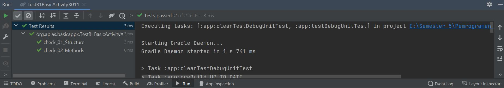
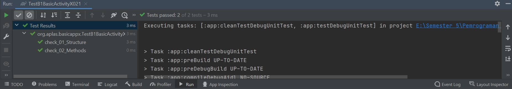
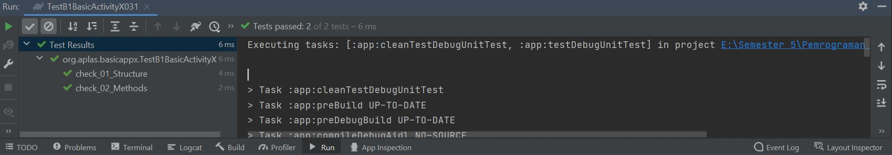
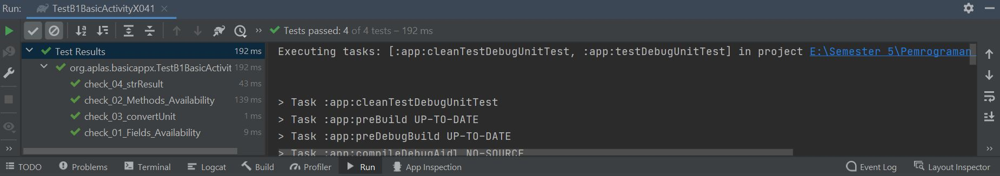
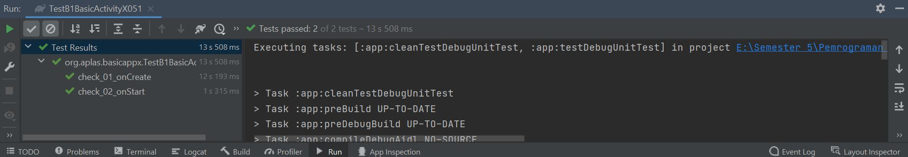
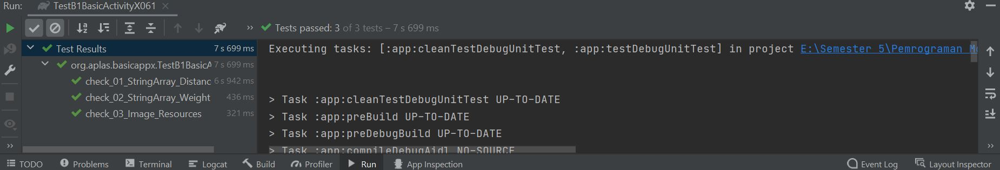
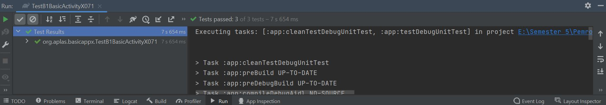
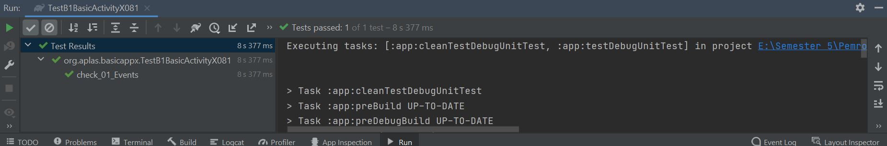
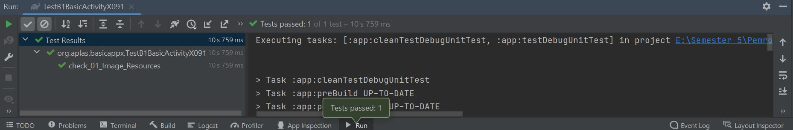
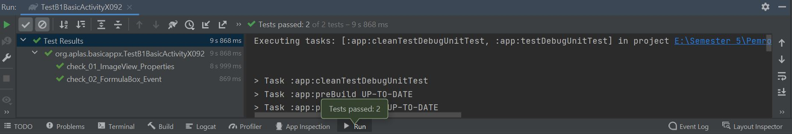

# 03 - Basic Java UI

## Tujuan Pembelajaran

1. Mahasiswa dapat mengetahui cara memulai Project Android Studio dengan layout kosong.

## Hasil Praktikum

Berikut ini adalah bukti hasil praktikum

[Link Source Code](../../src/03_A1_basic_java_ui/app/src/main/res/layout/activity_main.xml)